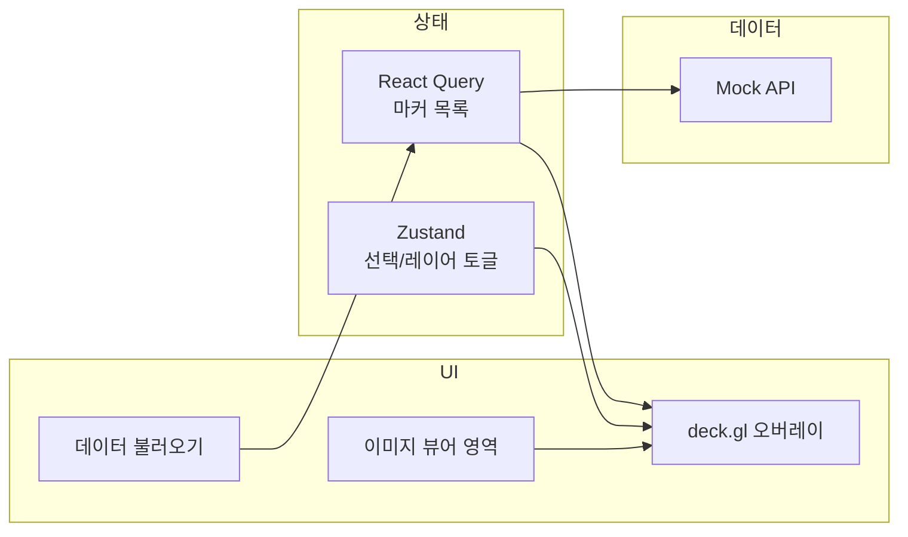

# 이미지 + 마커 오버레이 PoC 계획

**범위:** 스터디용 최소 기능. 단일 이미지, mock API 1개, 화면 1개.

---

## 기술 스택 및 역할

| 구분 | 라이브러리 | 역할 |
|------|------------|------|
| 빌드/UI | React 18 + Vite | 앱 골격, 컴포넌트 |
| 서버 상태 | TanStack React Query | 마커 데이터 fetch, 캐시, loading/error |
| 클라이언트 상태 | Zustand | 선택된 마커 ID, 레이어 on/off 등 UI 상태 |
| 오버레이 | deck.gl | 이미지 위 점/사각형 렌더링 |

---

## 아키텍처·데이터 흐름



- 사용자가 "데이터 불러오기" 클릭 → React Query가 mock API 호출 → 응답을 캐시하고 deck.gl 레이어에 전달.
- Zustand는 "어떤 마커 선택됐는지", "오버레이 표시 여부" 등만 담당.

---

## 구현 단계

**1. 프로젝트 초기화**
- Vite + React (TypeScript) 템플릿으로 생성.
- 의존성 추가: `zustand`, `@tanstack/react-query`, `deck.gl`, `react-pmap`(선택, deck.gl React 바인딩은 공식 `@deck.gl/react` 사용).

**2. Mock API**
- `/public` 또는 `src/mocks`에 정적 JSON: `[{ id, x, y, label }]` 또는 박스 `[{ id, x, y, width, height, label }]`. 이미지 픽셀 좌표 또는 0~1 정규화 좌표 중 하나로 통일.
- `fetch`로 해당 JSON을 불러오는 함수 1개 (지연 `setTimeout`으로 로딩 체감 가능하게 할지 선택).
- 실제 경로 예: `src/api/mockMarkers.ts` 또는 `src/mocks/markers.json` + `src/api/fetchMarkers.ts`.

**3. React Query 설정**
- `QueryClientProvider`를 앱 루트에 감싸기.
- `useQuery` 훅으로 마커 fetch (키 예: `['markers']`). "데이터 불러오기" 버튼은 `refetch` 호출 또는 초기 마운트 시 자동 fetch 중 택일.

**4. Zustand 스토어**
- 스토어 1개: `selectedMarkerId: string | null`, `overlayVisible: boolean` (및 필요 시 `setSelectedMarkerId`, `setOverlayVisible`).
- 파일 예: `src/stores/viewerStore.ts`.

**5. 이미지 뷰어 영역**
- 단일 `img` 또는 `div`에 배경 이미지 1장 표시. 크기 고정 또는 aspect ratio 유지.
- 이 영역과 deck.gl 뷰포트를 동일한 크기/위치로 맞추기 (같은 컨테이너에 절대 위치로 deck 캔버스를 이미지 위에 겹침).

**6. deck.gl 오버레이**
- `Deck`(또는 `DeckGL`) 컴포넌트를 이미지와 동일한 viewState(위·좌·줌)로 설정. 이미지가 단일 고정이면 orthographic view로 이미지 크기 = view bounds로 두면 됨.
- React Query로 받은 마커 데이터를 `ScatterplotLayer`(점) 또는 `SolidPolygonLayer`(사각형)에 전달. 좌표계를 이미지 픽셀/정규화와 맞추기.
- Zustand의 `overlayVisible`이 false면 레이어를 빈 배열로 두거나 해당 레이어만 제거.
- (선택) 마커 클릭 시 Zustand `setSelectedMarkerId` 호출 — deck.gl의 `onClick` 등 활용.

**7. UI 꾸미기**
- 상단 또는 옆에 "데이터 불러오기" 버튼, 로딩/에러 메시지(React Query의 `isLoading`, `isError`).
- (선택) 오버레이 on/off 스위치, 선택된 마커 라벨 표시 — 모두 Zustand 구독.

---

## 디렉터리 구조 (안)

```
src/
  api/
    fetchMarkers.ts      # mock fetch
  mocks/
    markers.json         # (또는 api 안에 하드코딩)
  stores/
    viewerStore.ts       # Zustand
  components/
    ImageMarkerViewer.tsx  # 이미지 + Deck 겹친 영역
    OverlayLayer.tsx       # deck.gl 레이어 구성 (또는 Viewer 안에 통합)
  App.tsx
  main.tsx
  ...
public/
  sample.jpg             # 테스트용 이미지 1장
```

---

## 좌표계

- 이미지와 deck.gl이 같은 좌표계를 쓰도록 할 것. 권장: **이미지 픽셀 좌표** (예: 이미지 800x600이면 x,y를 0~800, 0~600). deck.gl view를 `bounds` 또는 orthographic으로 이미지 픽셀 크기에 맞추면 오버레이가 정확히 겹침.

---

## 검증 포인트 (스터디 목표)

- React Query: 한 번 불러온 마커가 캐시되어 재요청 시 즉시 표시되는지.
- Zustand: 오버레이 on/off, 선택 상태 변경 시 리렌더링만 발생하고 fetch는 다시 일어나지 않는지.
- deck.gl: 이미지와 동일한 영역에 점/사각형이 붙는지, 줌/팬이 있다면 viewState와 동기화되는지.

---

## 이후 확장 (참고만)

- WSI 전용 뷰어가 필요해지면 [poc-context.mdc](.cursor/rules/poc-context.mdc)대로 OpenSeaDragon 도입 검토.
- 실제 백엔드 API로 교체 시 `fetchMarkers`만 URL/인증만 바꾸고 React Query 키/타입은 유지.
