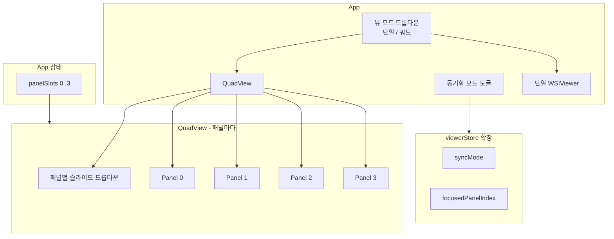

# 쿼드뷰·동기화 모드 구현 계획

## 요구사항 정리

| 구분 | 요구사항 |
|------|----------|
| 쿼드 | 2×2 4패널, 패널별 서로 다른 파일(fileId) 표시, fileId→패널 매핑 유지 |
| 타일 | onTileLoaded에 fileId(또는 fileId 집합) 전달 |
| 배율 | 포커스 뷰 하나만 배율 표시 (마우스 진입/클릭 또는 최근 줌/패닝한 패널) |
| 닫기 | 패널 단위 슬라이드 닫기 |
| 동기화 ON | 진입 시 배율을 좌상단 슬라이드 기준으로 4뷰 동일하게 맞춤 |
| 동기화 ON | 한 뷰에서 드래그(패닝) 시 이동량을 나머지 3뷰에 동일 적용 (절대 좌표 일치 불필요) |
| 동기화 ON | 한 뷰에서 줌 시 동일 배율을 나머지 뷰에 적용 |
| 동기화 OFF | 뷰별 독립 드래그/패닝 |
| UI | 상단 "동기화 모드" 체크박스 또는 토글, 기본값 OFF |

---

## 사용자 선택 사항 (반영)

- **뷰 모드 전환:** 상단에 **드롭다운**을 두어 **"단일 뷰 모드"** / **"쿼드뷰 모드"** 를 선택한다. 단일 뷰일 때는 기존처럼 하나의 큰 WSIViewer(또는 단일 이미지 뷰어)만 표시하고, 쿼드뷰일 때는 2×2 패널을 표시한다.
- **패널 슬라이드 할당:** **패널마다 작은 드롭다운**을 두어, 해당 패널에 표시할 슬라이드를 선택한다. 빈 값(또는 "선택 안 함")이면 패널을 비우거나 플레이스홀더를 보여 준다.

---

## 아키텍처

- **App:** 뷰 모드 드롭다운(단일 / 쿼드), `panelSlots: (string | null)[]`(길이 4), 동기화 토글. 단일 모드일 때는 기존 `selectedSlideId` + 단일 WSIViewer; 쿼드 모드일 때는 QuadView + 패널별 슬롯.
- **QuadView:** 2×2 그리드, **각 패널에 작은 드롭다운**(슬라이드 목록, 빈 값 가능) + 닫기 + WSIViewer. 드롭다운 변경 시 `setPanelSlot(panelIndex, slideId | null)` 호출.
- **패널:** WSIViewer + 배율(포커스 시만) + 닫기 버튼 + **해당 패널용 슬라이드 선택 드롭다운**.

---

## 1. 상태·스토어 확장

**파일:** [src/stores/viewerStore.ts](src/stores/viewerStore.ts)

- **syncMode: boolean** — 동기화 모드 ON/OFF, 기본 `false`.
- **setSyncMode(on: boolean)** — 상단 토글에서 사용.
- **focusedPanelIndex: number \| null** — 배율을 표시할 패널(0~3). 포커스 없으면 `null` 또는 0.
- **setFocusedPanel(index: number \| null)** — 마우스 진입/클릭·줌/패닝 시 해당 패널로 설정.

**패널 슬롯:** App 상태로 유지. `panelSlots: (string | null)[]` 길이 4, `setPanelSlot(panelIndex: number, slideId: string | null)`.

---

## 2. WSIViewer 재사용 및 패널용 확장

**파일:** [src/components/WSIViewer.tsx](src/components/WSIViewer.tsx)

- **showScale?: boolean** — `true`일 때만 상단 배율·중심 표시. QuadView에서 `showScale={focusedPanelIndex === panelIndex}` 로 전달.
- **forwardRef + getViewport** — 부모가 `panBy`, `zoomTo`/`zoomBy` 호출할 수 있도록 viewport 메서드만 노출.
- **onFocus?: () => void** — 패널 컨테이너 `onMouseEnter`/`onClick` 및 OSD pan/zoom 핸들러에서 호출 → `setFocusedPanel(panelIndex)`.
- **onTileLoaded?: (fileId: string) => void** — OSD `addHandler('tile-loaded', ...)` 에서 해당 뷰의 `slideId`로 콜백 호출(호출 빈도 제한 가능).
- 닫기는 **패널 래퍼**에서 버튼으로 처리 → `onClose()` → `setPanelSlot(panelIndex, null)`.

---

## 3. QuadView 컨테이너

**신규 파일:** `src/components/QuadView.tsx`

- **2×2 CSS Grid** 로 4개 패널 배치.
- **각 패널 영역 구성**
  - **패널마다 작은 드롭다운:** 슬라이드 목록(slides from API) + "비움" 옵션. 선택 시 `setPanelSlot(panelIndex, value)`.
  - 닫기 버튼(선택 시 해당 슬롯만 null로).
  - `panelSlots[i]`가 있으면 해당 `slideId`·`slideInfo`로 WSIViewer 렌더, 없으면 플레이스홀더("슬라이드 선택" 등).
- **상단:** "동기화 모드" 체크박스/토글 → `viewerStore.setSyncMode(on)`.
- **동기화 로직:** 4개 WSIViewer ref 보유. 한 패널에서 pan 시 delta 추정 후 나머지 3개 `viewport.panBy(delta)`; zoom 시 `getZoom()`으로 나머지 3개 `viewport.zoomTo(zoom, getCenter())`. 동기화 ON 전환 시 좌상단(0) 기준으로 나머지 3뷰 zoom/pan 맞춤.

---

## 4. App 통합

**파일:** [src/App.tsx](src/App.tsx)

- **상단 뷰 모드 드롭다운 추가**
  - 옵션: "단일 뷰 모드", "쿼드뷰 모드".
  - 상태: `viewMode: 'single' | 'quad'`.
  - 단일 뷰일 때: 기존처럼 `selectedSlideId` + 하나의 WSIViewer(또는 단일 이미지 뷰어) + 기존 오버레이/데이터 불러오기 UI.
  - 쿼드뷰일 때: `panelSlots` 사용, QuadView 렌더, QuadView 내부에 동기화 토글.
- **panelSlots:** `(string | null)[]` 길이 4, `setPanelSlot(i, slideId | null)`. 쿼드뷰에서만 사용.
- **slideInfo:** 패널별로 다른 슬라이드이므로 `useQueries`로 4개 슬롯의 `slideId`에 대해 각각 `fetchSlideInfo` 호출(해당 slot이 non-null일 때만 enabled).
- **마커/오버레이:** 1단계는 기존 전역 markers/tumorAreas를 4개 패널에 동일 전달해도 됨.

---

## 5. 동기화 상세 (OSD 뷰포트)

- **pan:** pan 핸들러에서 이전 중심과 `getCenter(true)` 차이로 delta 계산 → 나머지 3개 `viewport.panBy(delta)`.
- **zoom:** zoom 핸들러에서 `getZoom(true)` 읽어 나머지 3개 `viewport.zoomTo(zoom, viewport.getCenter(true))`.
- **동기화 ON 전환 시:** 좌상단(0)의 viewport에서 `getZoom()`, `getCenter()` 읽어 1·2·3번에 `zoomTo(z, c)`, `panTo(c)` 적용.

---

## 6. onTileLoaded

OSD `addHandler('tile-loaded', ...)` 에서 해당 뷰의 `slideId`를 인자로 `onTileLoaded?.(slideId)` 호출. 필요 시 "첫 타일 로드 시 한 번만" 등으로 제한 가능.

---

## 7. 구현 순서

1. viewerStore 확장 (syncMode, focusedPanelIndex, setter).
2. WSIViewer 확장 (showScale, onFocus, onTileLoaded, forwardRef + getViewport).
3. QuadView 컴포넌트 (2×2, **패널마다 작은 드롭다운**, 닫기, 동기화 토글, 4 ref, pan/zoom 동기화).
4. App 수정 (**상단 뷰 모드 드롭다운** 단일/쿼드, panelSlots, 쿼드 시 QuadView, useQueries로 패널별 slideInfo).
5. 동기화 ON 시 좌상단 기준 초기 맞춤.
6. onTileLoaded 연동.

---

## 8. 파일 변경 요약

| 파일 | 변경 |
|------|------|
| [src/stores/viewerStore.ts](src/stores/viewerStore.ts) | syncMode, focusedPanelIndex 및 setter 추가 |
| [src/components/WSIViewer.tsx](src/components/WSIViewer.tsx) | showScale, onFocus, onTileLoaded, forwardRef + getViewport 노출 |
| [src/components/QuadView.tsx](src/components/QuadView.tsx) | 신규: 2×2, **패널마다 슬라이드 드롭다운**, 닫기, 동기화 토글, ref·동기화 로직 |
| [src/App.tsx](src/App.tsx) | **상단 뷰 모드 드롭다운(단일/쿼드)**, panelSlots, QuadView 렌더, 패널별 slideInfo 쿼리 |
