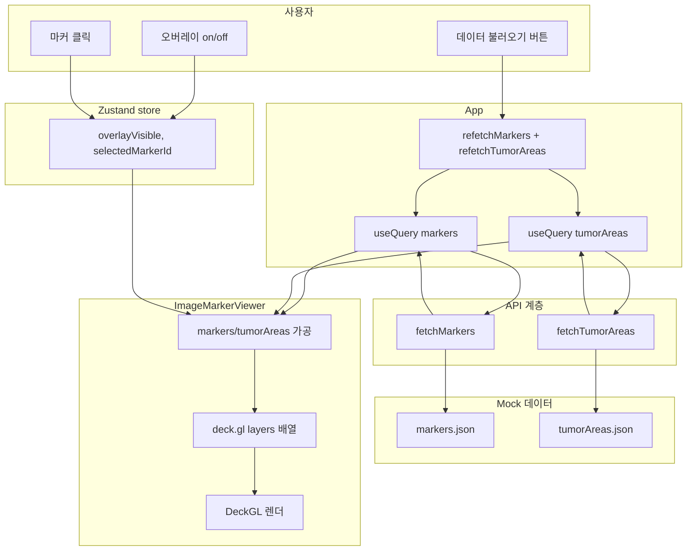

# 현재까지 작업 정리

이 문서는 이미지 마커 오버레이 PoC 프로젝트의 목표, 기술 스택, 구현 내용, 디렉터리 구조, 데이터 형식을 정리한 것이다.

---

##### 5. 프로젝트 목표·배경

- **배경:** 기존 Windows용 WSI(Whole Slide Image) 뷰어 + AI 분석 결과 오버레이 프로그램을 웹으로 전환할 수 있는지 검토하기 위한 스터디.
- **목표:** 기술 스택 이해도를 높이기 위한 최소 PoC. 이미지 1장 위에 mock API로 받은 마커·영역 데이터를 deck.gl로 오버레이하여 표시.
- **범위:** 단일 이미지, mock API, 화면 1개. 기능 완성도보다 스택 활용 연습에 초점.

---

##### 6. 데이터 플로우

**전체 흐름 요약**

1. 사용자가 "데이터 불러오기" 클릭 → App에서 두 개의 React Query `refetch()` 호출.
2. `fetchMarkers()`, `fetchTumorAreas()`가 각각 mock(JSON import + 지연) 호출 → 데이터 반환.
3. React Query가 응답을 캐시하고 `data`로 App에 전달. `markers`, `tumorAreas`가 ImageMarkerViewer에 props로 내려감.
4. ImageMarkerViewer는 Zustand에서 `overlayVisible`, `selectedMarkerId`를 구독.
5. `markers`·`tumorAreas`와 Zustand 상태로 레이어 데이터를 가공(tumor 폴리곤, 박스 폴리곤, 점 좌표) → deck.gl `layers` 배열 생성.
6. DeckGL 컴포넌트가 layers를 받아 WebGL로 렌더. 마커 클릭 시 `onClick`에서 Zustand `setSelectedMarkerId` 호출 → 리렌더 → 선택 강조.

**데이터가 흐르는 경로**

- **서버/캐시 데이터:** Mock JSON → fetch 함수 → React Query 캐시 → App `data` → ImageMarkerViewer `markers`/`tumorAreas` props → 레이어 `data`/`getPolygon`/`getPosition` 입력.
- **UI 상태:** 체크박스/클릭 → Zustand 액션 → store 갱신 → ImageMarkerViewer 구독 리렌더 → `overlayVisible`로 레이어 유무, `selectedMarkerId`로 강조 여부 결정.

**플로우 다이어그램**



- **초기 로드:** `enabled: false`이므로 마운트 시에는 fetch 없음. 버튼으로만 로드.
- **캐시:** 같은 쿼리 키로 재요청 시 캐시에서 즉시 반환. 네트워크 재요청 없음.
- **레이어 순서:** tumor-areas → box-markers → point-markers. 아래 레이어가 먼저 그려지고 위 레이어가 덮음.

---

##### 7. 기술 스택 전체

**런타임 의존성 (dependencies)**

| 패키지 | 버전 | 역할 |
|--------|------|------|
| react | ^18.3.1 | UI 라이브러리, 컴포넌트·훅 |
| react-dom | ^18.3.1 | React를 DOM에 렌더링 |
| @tanstack/react-query | ^5.62.0 | 서버 상태: fetch, 캐시, loading/error, useQuery |
| zustand | ^5.0.2 | 클라이언트 전역 상태 (viewerStore) |
| @deck.gl/core | ^9.2.0 | deck.gl 핵심: Deck, View, OrthographicView |
| @deck.gl/layers | ^9.2.0 | ScatterplotLayer, SolidPolygonLayer |
| @deck.gl/react | ^9.2.0 | React용 DeckGL 컴포넌트 |

**개발 의존성 (devDependencies)**

| 패키지 | 버전 | 역할 |
|--------|------|------|
| vite | ^5.4.11 | 빌드·개발 서버, HMR |
| @vitejs/plugin-react | ^4.3.4 | Vite에서 React(JSX) 변환 |
| typescript | ~5.6.2 | 타입 체크, TS 컴파일 |
| @types/react | ^18.3.12 | React 타입 정의 |
| @types/react-dom | ^18.3.1 | React DOM 타입 정의 |
| eslint | ^9.15.0 | 린트 |
| @eslint/js | ^9.15.0 | ESLint flat config |
| typescript-eslint | ^8.15.0 | TypeScript ESLint 규칙 |
| eslint-plugin-react-hooks | ^5.0.0 | React Hooks 린트 규칙 |
| eslint-plugin-react-refresh | ^0.4.14 | React Fast Refresh 시 린트 |
| globals | ^15.12.0 | ESLint 환경 전역 변수 정의 |

**역할별 정리**

| 구분 | 기술 | 역할 |
|------|------|------|
| 빌드/번들 | Vite | ESM 기반 번들, dev 서버, path alias(@/) |
| 언어 | TypeScript | 정적 타입, 타입 정의(marker.ts 등) |
| UI | React 18 | 함수형 컴포넌트, 훅 |
| 서버 상태 | React Query | 마커·tumor area fetch·캐시·상태 |
| 클라이언트 상태 | Zustand | 오버레이 표시 여부, 선택 마커 ID |
| 오버레이 렌더 | deck.gl | OrthographicView + Scatterplot/SolidPolygon 레이어, 이미지 픽셀 좌표계 |
| 좌표계 | 이미지 픽셀 (800×600) | OrthographicView flipY: true로 top-left 원점 |

---

##### 8. 구현된 기능

- **데이터 불러오기:** 버튼 클릭 시 마커·tumor area를 각각 React Query로 fetch. 로딩/에러 메시지 표시.
- **이미지 뷰어:** 800×600 고정 영역, placeholder 이미지 또는 `imageSrc` prop. deck.gl 캔버스를 이미지 위에 겹쳐 표시.
- **오버레이 레이어 (아래→위 순):**
  - **Tumor area:** 반투명 빨간 영역 + 테두리. `TumorArea` 폴리곤 데이터.
  - **박스 마커:** 사각형 폴리곤. 클릭 시 선택(강조), Zustand에 선택 ID 저장.
  - **점 마커:** ScatterplotLayer. 클릭 시 선택(강조).
- **오버레이 표시 on/off:** 체크박스로 전체 오버레이 표시/숨김 (Zustand `overlayVisible`).
- **선택된 마커 표시:** 선택된 마커 라벨 + 해제 버튼 (마커/박스만, tumor area는 선택 미구현).

---

##### 9. 디렉터리 구조

```
src/
  api/
    fetchMarkers.ts      # 마커 mock fetch (markers.json)
    fetchTumorAreas.ts   # tumor area mock fetch (tumorAreas.json)
  mocks/
    markers.json         # 점·박스 마커 (147개: 점 46, 박스 101)
    tumorAreas.json      # tumor 영역 폴리곤 3개
  stores/
    viewerStore.ts       # Zustand: selectedMarkerId, overlayVisible, 액션
  types/
    marker.ts            # Marker, BoxMarker, TumorArea, isBoxMarker
  components/
    ImageMarkerViewer.tsx # 이미지 + deck.gl Deck, 레이어 구성
  App.tsx
  main.tsx
  index.css
  vite-env.d.ts
```

- 루트: `package.json`, `vite.config.ts`, `tsconfig*.json`, `index.html`, `.gitignore`, `README.md`.
- `.cursor/`: 규칙·계획 문서 (rules, plans).

---

##### 10. 데이터 형식

**마커 (MarkerItem)**

- **점:** `{ id, x, y, label }` (이미지 픽셀 x, y).
- **박스:** `{ id, x, y, width, height, label }`.

**Tumor area**

- `{ id, label, polygon }`  
- `polygon`: `[number, number][]` — 이미지 픽셀 좌표. 닫힌 폴리곤(첫 점 = 마지막 점) 또는 뷰어에서 자동으로 닫음.

---

##### 11. 실행 방법

```bash
npm install
npm run dev
```

- 브라우저에서 "데이터 불러오기" 클릭 → 마커·tumor area 로드.
- 오버레이 on/off, 마커 클릭 선택으로 동작 확인.

---

##### 12. 이후 확장 참고

- WSI 전용 뷰어: OpenSeaDragon 도입 검토 (`.cursor/rules/poc-context.mdc` 참고).
- 실제 백엔드: `fetchMarkers`, `fetchTumorAreas`에서 URL/인증만 교체하고 React Query 키·타입 유지.
- 계획 상세: `.cursor/plans/이미지_마커_오버레이_poc.plan.md`.
